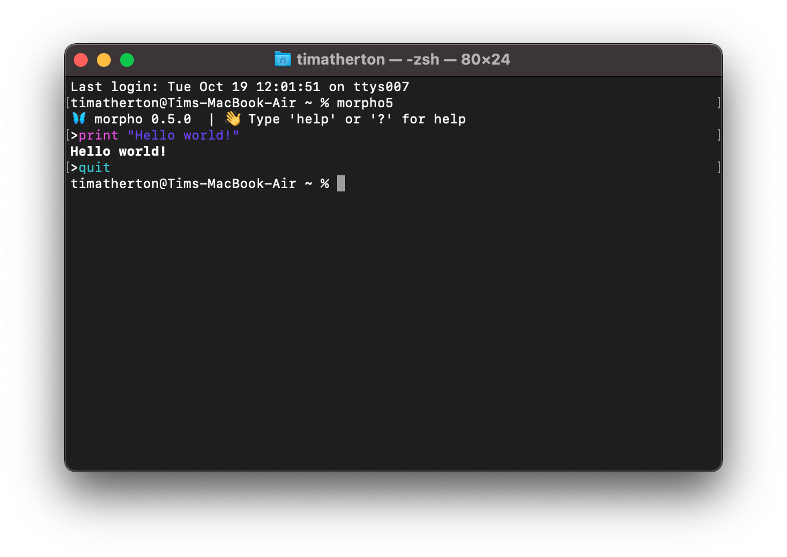

# Using *Morpho*

*Morpho* is a command line application, like `python` or `lua`. It can
be used to run scripts or programs, which are generally given the
*.morpho* file extension, or run interactively responding to user
commands.

## Running a program

To run a program, simply run morpho with the name of the file,

    morpho6 script.morpho

*Morpho* supports a number of switches:

**-w** : Run *morpho* with more than one worker thread, e.g. `-w 4` runs morpho with 4 threads.

**-D**: Display disassembly of the program without running it. *\[See developer guide\]*

**-d** : Debugging mode. Morpho will stop and enter the debugger whenever a `@` is encountered in the source. *\[See developer guide\]*

**-p** : Profile the program execution. Useful to identify performance bottlenecks. *\[See developer guide\]*

## Interactive mode

To use *morpho* interactively, simply load the *Terminal* application
(or equivalent on your system) and type

    morpho6

#### Command line interface for Morpho


As shown in the figure above, you'll be greeted by a brief welcome and a
prompt `>` inviting you to enter *morpho* commands. For now, try a
classic:
```javascript
print "Hello World"
```
which will display `Hello World` as output. More information about the
*morpho* language is provided in the Reference section, especially
chapter [Language](./reference/language.md) if you're familiar with C-like languages
such as C, C++, Java, Javascript, etc. things should be quite familiar.

To assist the user, the contents of the reference manual are available
to the user in interactive mode as online help. To get help, simply
type:

    help

or even more briefly,

    ?

to see the list of main topics. To find help on a particular topic, for
example `for` loops, simply type the topic name afterwards:

    ? for

Once you're done using *morpho*, simply type

    quit

to exit the program and return to the shell.

The interactive environment has a few other useful features to assist
the user:

-   **Autocomplete.** As you type, *morpho* will show you any suggested
    commands that it thinks you're trying to enter. For example, if you
    type `v` the command line will show the `var` keyword. To accept the
    suggestion, press the tab key. Multiple suggestions may be
    available; use the up and down arrow keys to rotate through them.

-   **Command history.** Use the arrow keys to retrieve previously
    entered commands. You may then edit them before running them.

-   **Line editing.** As you're typing a command, use the left and right
    arrows to move the cursor around; you can insert new characters at
    the cursor just by typing them or delete characters with the
    `delete` key. Hold down the `shift` key as you use the left and
    right arrow keys to select text; you can then use` Ctrl-C` to copy
    and `Ctrl-V` to paste. `Ctrl-A` moves to the start of the line and
    `Ctrl-E` the end.
